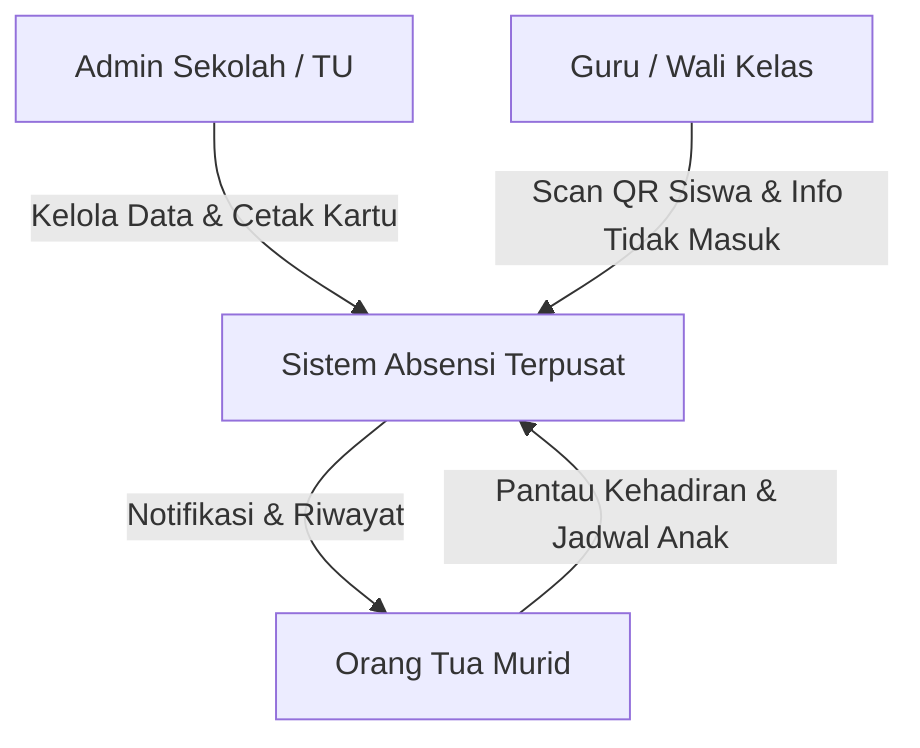
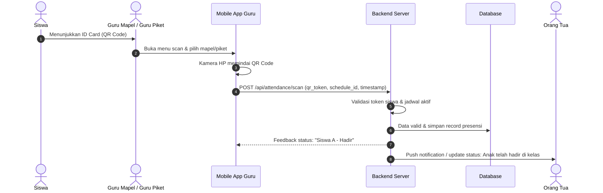
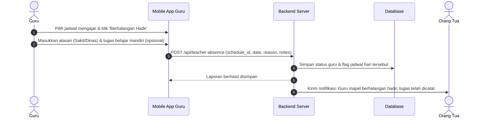
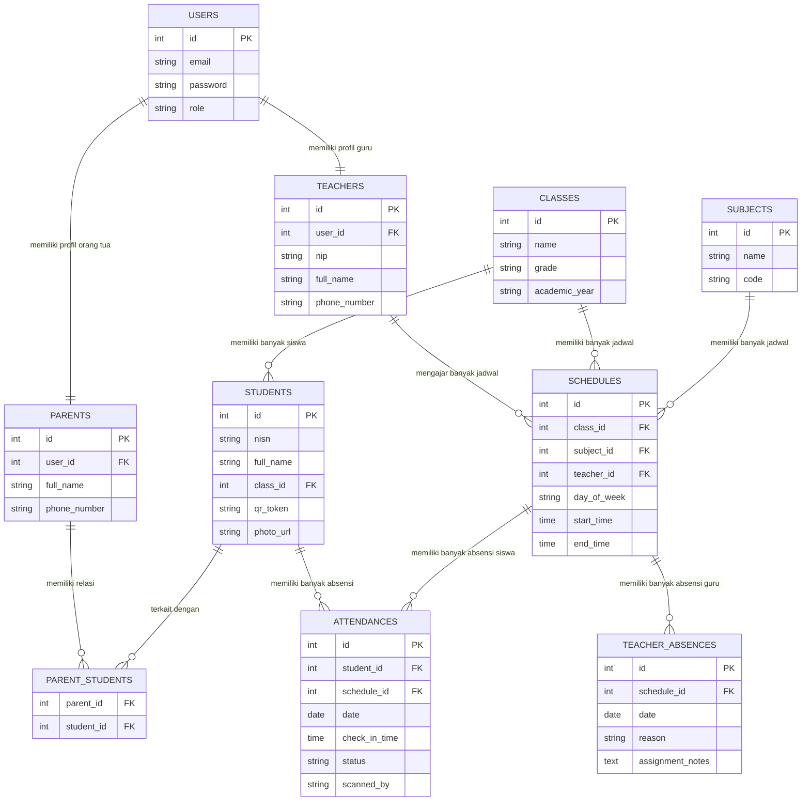
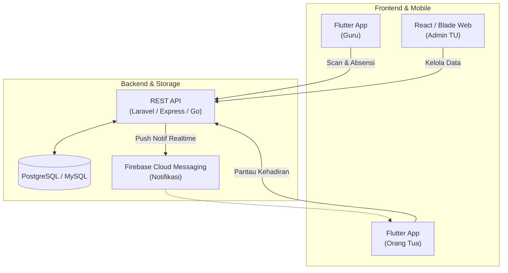

# Blueprint Sistem Absensi & Monitoring Siswa Berbasis QR Code ID Card (SMP & SMA)

---

## 1. Pendahuluan & Latar Belakang

Sistem ini dirancang untuk mendigitalkan proses pencatatan kehadiran siswa di tingkat SMP dan SMA, sekaligus memberikan transparansi penuh kepada orang tua murid secara *real-time*. Dengan memanfaatkan kamera *smartphone* guru/petugas untuk memindai kartu pelajar (ID Card) ber-QR code, sekolah dapat menghemat biaya pengadaan alat pemindai fisik (*barcode scanner hardware*) tanpa mengurangi efisiensi dan akurasi absensi.

---

## 2. Aktor & Peran Pengguna (User Roles)

### Diagram Peran Pengguna

### Tabel Peran dan Tanggung Jawab

| Peran | Tanggung Jawab Utama | Platform Akses |
| :--- | :--- | :--- |
| **Admin Sekolah / Tata Usaha (TU)** | • Mengelola data master siswa, kelas, guru, dan mata pelajaran. • Mengatur jadwal pelajaran mingguan (Senin–Jumat/Sabtu). • Menghasilkan (*generate*) data QR Code dan mencetak ID Card siswa. • Monitoring laporan kehadiran sekolah secara menyeluruh. | Web Dashboard |
| **Guru / Pengajar** | • Login ke aplikasi mobile. • Melakukan *scanning* QR code ID Card siswa menggunakan kamera HP pada jam mata pelajaran atau jam piket gerbang. • Melihat jadwal mengajar mingguan. • Mengisi dispensasi/status kehadiran (Hadir, Sakit, Izin, Alpa). • Mengirimkan notifikasi izin/berhalangan hadir jika guru tidak dapat mengajar ke sistem/orang tua. | Mobile App (Android/iOS) |
| **Orang Tua Murid** | • Login ke aplikasi mobile menggunakan kredensial khusus yang terhubung dengan akun siswa. • Melihat status absensi harian anak (apakah sudah sampai di sekolah atau belum). • Melihat absensi per mata pelajaran anak secara *real-time*. • Memantau jadwal mata pelajaran mingguan anak. • Menerima notifikasi jika ada guru mata pelajaran yang berhalangan hadir. | Mobile App (Android/iOS) |

---

## 3. Alur Proses Bisnis Utama (Core Workflows)

### 3.1. Alur Absensi Siswa via Scan QR Code

**Tahapan Alur:**
1. **Siswa** menunjukkan ID Card (QR Code) kepada guru mapel / guru piket.
2. **Guru** membuka menu scan dan memilih mata pelajaran atau jadwal piket pada aplikasi mobile.
3. Kamera smartphone memindai QR Code siswa (*fast continuous scan*).
4. Aplikasi mobile mengirim *request* `POST /api/attendance/scan` dengan parameter `qr_token`, `schedule_id`, dan `timestamp` ke backend server.
5. **Backend Server** memvalidasi keabsahan token siswa dan jadwal yang sedang aktif.
6. Data tervalidasi dan sistem menyimpan data presensi ke dalam database.
7. Backend memberikan respon balik (*feedback*) ke aplikasi guru berupa konfirmasi kehadiran siswa (disertai getar/suara).
8. Backend mengirim *push notification* ke aplikasi orang tua mengenai status kehadiran anak di kelas secara *real-time*.

---

### 3.2. Alur Pelaporan Guru Berhalangan Hadir

**Tahapan Alur:**
1. **Guru** memilih jadwal mengajar yang bersangkutan pada aplikasi mobile dan memilih opsi **Berhalangan Hadir**.
2. Guru mengisi formulir alasan (Sakit, Dinas Luar, dsb.) serta catatan instruksi atau tugas belajar mandiri untuk siswa (opsional).
3. Aplikasi mobile mengirim *request* `POST /api/teacher-absence` beserta detail `schedule_id`, `date`, `reason`, dan `notes`.
4. **Backend Server** menyimpan status izin guru ke database dan menandai jadwal pada hari tersebut.
5. Backend mengembalikan status respon berhasil ke aplikasi guru.
6. Backend memicu pengiriman *push notification* kepada orang tua murid bahwa guru mapel berhalangan hadir dan tugas telah dicatat.

---

## 4. Desain Struktur Data & Database (ERD)

### Diagram Relasi Entitas (ERD)

### Rincian Tabel Database

1. **`USERS`**: Menyimpan kredensial akun pengguna sistem (*Admin, Teacher, Parent*).
2. **`TEACHERS`**: Informasi profil data pengajar/guru (`nip`, `full_name`, `phone_number`), berelasi 1:1 dengan `USERS`.
3. **`PARENTS`**: Profil orang tua murid, berelasi 1:1 dengan `USERS`.
4. **`CLASSES`**: Data rombongan belajar/kelas (`name`, `grade`, `academic_year`).
5. **`SUBJECTS`**: Master mata pelajaran (`name`, `code`).
6. **`STUDENTS`**: Data siswa, mencakup relasi kelas, foto, NISN, serta `qr_token` (token unik untuk QR Code).
7. **`PARENT_STUDENTS`**: Tabel perantara (pivot) untuk menghubungkan orang tua dengan satu atau lebih siswa (anak).
8. **`SCHEDULES`**: Alokasi jadwal mingguan yang mengaitkan kelas, mata pelajaran, guru, hari (`day_of_week`), serta jam mulai/selesai.
9. **`ATTENDANCES`**: Catatan presensi kehadiran siswa per sesi jadwal (`date`, `check_in_time`, status kehadiran: Hadir/Sakit/Izin/Alpa, dan siapa yang memindai).
10. **`TEACHER_ABSENCES`**: Catatan ketidakhadiran guru pada jadwal tertentu beserta alasan dan instruksi tugas mandiri.

---

## 5. Fitur Rinci per Modul

### A. Modul Master & Kartu Siswa (Web Admin)
1. **Manajemen Pengguna & Rombel**:
   - Operasi CRUD (Create, Read, Update, Delete) untuk Siswa, Kelas, Guru, dan Jadwal Pelajaran (Senin s.d. Jumat/Sabtu).
2. **Generator Kartu Pelajar (ID Card Generator)**:
   - Membuat kartu siap cetak (ukuran standar ID Card CR80).
   - Menanamkan QR Code berisi *hash* unik (`qr_token`), bukan *plain text* NISN, untuk menjaga kerahasiaan dan keamanan data.
   - Ekspor *template* ID Card ke dalam format PDF untuk dicetak massal.

### B. Modul Guru (Mobile App)
1. **Scanner QR Kamera Bawaan HP**:
   - Deteksi cepat (*fast continuous scan*) tanpa perlu menekan tombol berulang kali saat pergantian siswa.
   - Umpan balik berupa suara (*beep*) atau getar saat QR Code siswa berhasil ter-scan.
2. **Presensi Manual & Rekap Kelas**:
   - Tombol pengganti manual jika kartu siswa tertinggal atau hilang (pilihan status: Sakit, Izin, atau Alpa).
3. **Pemberitahuan Guru Berhalangan Hadir**:
   - Formulir izin bagi guru untuk jam mengajar tertentu, dilengkapi pesan/tugas pengganti yang diteruskan secara otomatis ke orang tua dan wali kelas.

### C. Modul Orang Tua (Mobile App)
1. **Dashboard Monitoring Real-time**:
   - Indikator status anak hari ini: *Belum Hadir*, *Di Sekolah*, *Sedang Mengikuti Mapel [X]*, atau *Izin/Sakit*.
2. **Jadwal Pelajaran Lengkap**:
   - Kalender/daftar mata pelajaran Senin s.d. Jumat/Sabtu.
   - Status kehadiran di tiap slot jam pelajaran (misal: *Jam 1 Matematika - Hadir*, *Jam 2 Bahasa Indonesia - Hadir*).
3. **Pusat Notifikasi**:
   - Riwayat notifikasi waktu masuk/kehadiran di sekolah.
   - Informasi resmi jika guru mata pelajaran berhalangan hadir beserta tugas yang diberikan.

---

## 6. Rekomendasi Arsitektur Teknologi

### Diagram Arsitektur

### Rincian Komponen Teknologi:

* **Mobile Client**: **Flutter (Dart)** – Dapat dikembangkan menjadi 1 aplikasi dengan *multi-role login*, atau 2 aplikasi terpisah. Mendukung pemindaian kamera berkecepatan tinggi dengan memanfaatkan *library* `mobile_scanner`.
* **Backend API**: **Laravel (PHP)** atau **Node.js (NestJS / Express)** – Laravel sangat cepat untuk integrasi Web Admin (menggunakan FilamentPHP) dan menyediakan mekanisme autentikasi API yang aman (*Sanctum / JWT*).
* **Database**: **PostgreSQL** atau **MySQL** – Relasional dan stabil untuk menangani relasi data jadwal dan transaksi presensi secara konsisten.
* **Push Notification**: **Firebase Cloud Messaging (FCM)** – Layanan gratis dan efisien untuk mengirimkan notifikasi *real-time* langsung ke perangkat *smartphone* orang tua murid.
